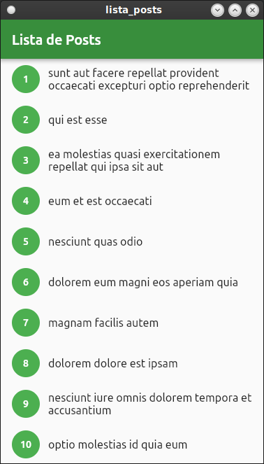

# Projeto Lista de Posts Flutter/Dart

Projeto Criado para cumprir o Assigment #LevelUP Extra! da Raro Academy.

## Tela Construída

A aplicação usa o cliente Http Dio pra se comunicar com a API http://jsonplaceholder.typicode.com/posts

### - Print de tela Home Page
 

 

